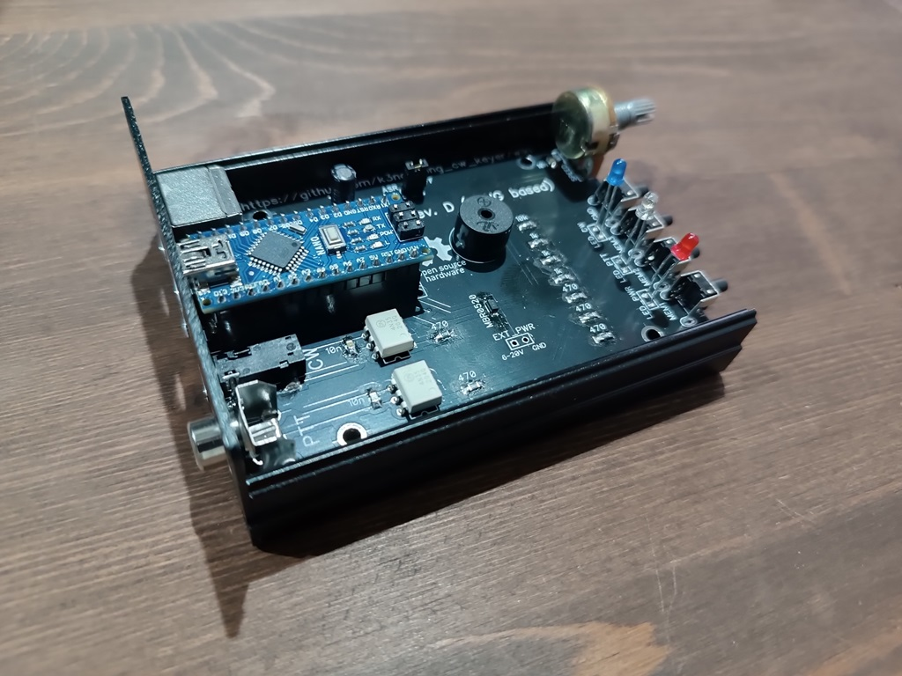
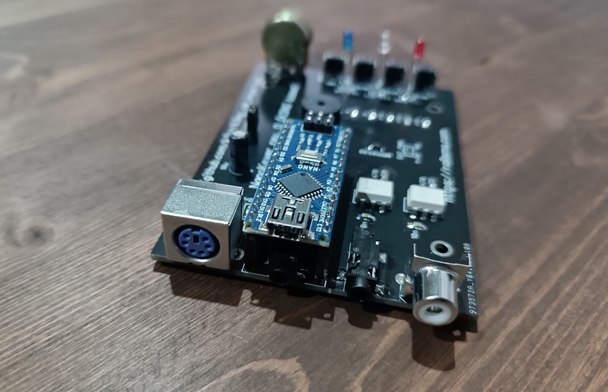

# Clone of nanokeyer (based on K3NG keyer)

More information on nanokeyer web-site

https://ra0sms.com/swr_power_meter/

This is clone of nanokeyer based on Arduino Nano board. It has full-compatibility with Winkeyer protocol.

DipTrace folder has gerber files for PCB.

